# 巡檢系統圖文操作手冊

適用版本：巡檢系統 API 2.2.0。製作日期：2026 年 10 月 5 日。

本手冊使用目前程式的實際瀏覽器截圖。帳號、地點、案件與照片均為獨立示範資料；附件縮圖使用系統畫面作為範例，正式巡檢請上傳現場照片。截圖中的日期、編號與數量會依實際資料不同。

## 使用前準備

請向管理員取得系統網址與帳號。若尚未啟動系統，請管理員依 [專案 README](../README.md) 安裝及啟動。雲端機器內的 `127.0.0.1` 無法直接作為其他電腦的系統網址。

建議依序完成：登入改密碼 → 建立帳號 → 地點與項目維護 → 地點項目設定 → 排程 → 執行巡檢與照片 → 提交 → 結果查詢 → 異常指派 → 改善 → 複查結案。

| 操作者 | 主要工作 |
| --- | --- |
| 系統管理員 | 帳號管理、角色分配、維護與全部管理功能 |
| 巡檢管理員 | 維護資料、排程管理、巡檢與異常複查 |
| 巡檢人員 | 執行巡檢、查看自己的紀錄、處理自己負責的異常 |
| 查詢人員 | 查看已提交結果及異常資料，不執行巡檢或管理排程 |

功能按鈕會隨角色與資料狀態顯示或隱藏。查詢人員不會看到巡檢排程；巡檢人員不能管理地點與項目。

## 01｜登入

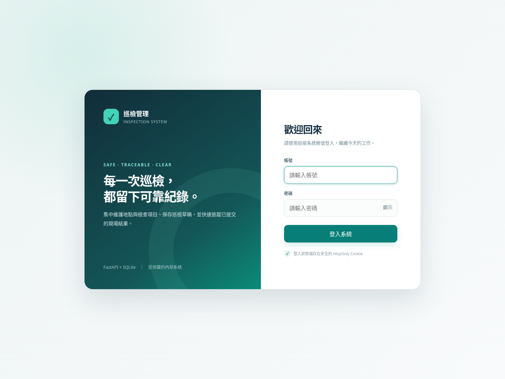

1. 輸入管理員提供的帳號與密碼。
2. 按「登入」，進入主頁；首次登入會先出現修改密碼視窗。
3. 全新資料庫的預設管理員為 `admin`，初始密碼為 `Admin@12345`；管理員若已自訂或修改，請使用新的帳密。

**確認結果：** 成功進入主頁或首次改密碼視窗。連續登入失敗 5 次會鎖定 15 分鐘，不要反覆猜測密碼。

## 02｜首次修改密碼

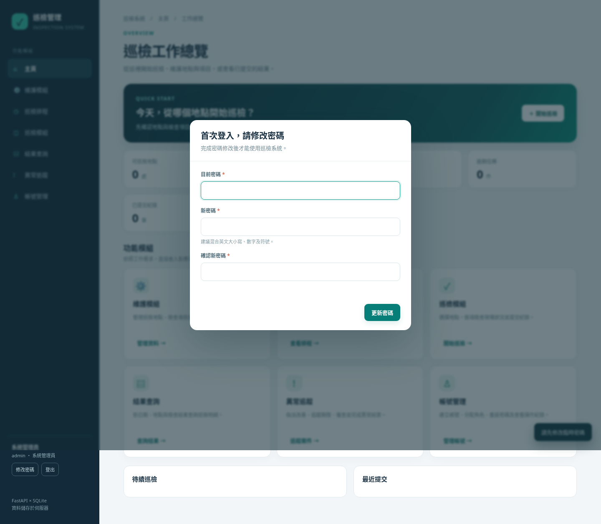

1. 「目前密碼」填入登入使用的初始或臨時密碼。
2. 輸入至少 10 個字元的新密碼，且不可與舊密碼相同。
3. 再輸入一次新密碼，按「更新密碼」。

**確認結果：** 視窗關閉，可操作其他功能；下次登入使用新密碼。日後可用左下角「修改密碼」更換密碼。修改密碼會使其他既有 Session 失效。

## 03｜認識主頁

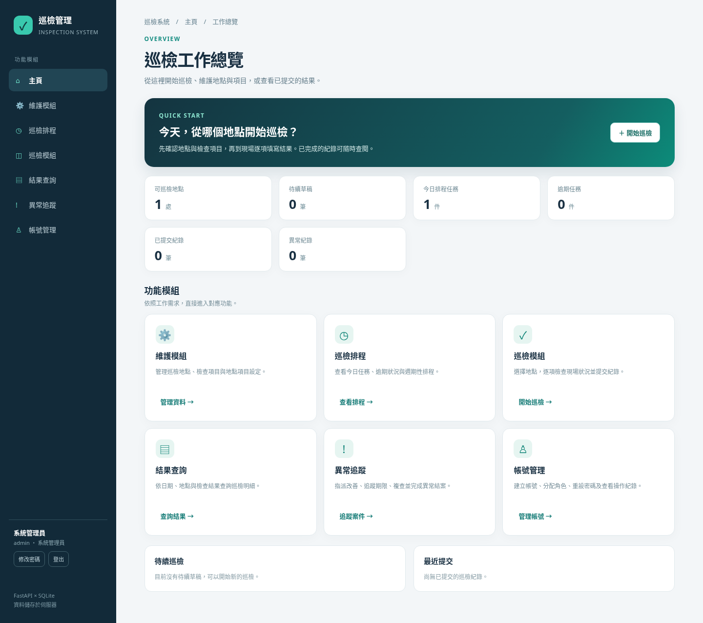

左側是功能選單，左下角顯示目前帳號及登出按鈕。主頁上方顯示可巡檢地點、待續草稿、今日任務、逾期任務、已提交紀錄與異常紀錄。下方功能卡片可直接進入對應模組。

**操作提示：** 要完成指定的排程任務，請從「巡檢排程」的任務按「開始巡檢」，不要另建一筆一般巡檢取代排程任務。

## 04｜建立與管理帳號（系統管理員）

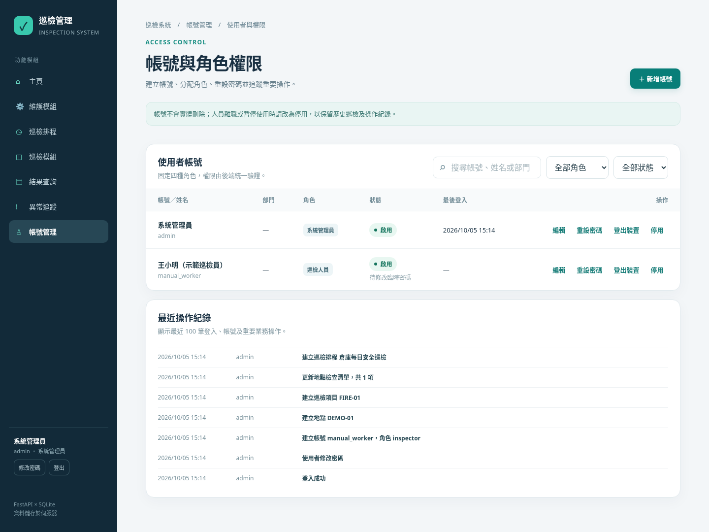

1. 選擇「帳號管理」，按新增帳號的按鈕。
2. 填入帳號、顯示名稱、角色及臨時密碼，依需要補上部門等資料。
3. 儲存後，將帳號與臨時密碼透過安全方式提供給本人。
4. 請使用者登入並完成首次改密碼。必要時可重設密碼、停用帳號或登出所有裝置。

**確認結果：** 帳號列出正確角色與狀態。系統不允許停用自己，也不能移除最後一位有效系統管理員。異常提報人不可自行複查結案，因此完整試用需準備另一位管理員。

## 05｜新增巡檢地點

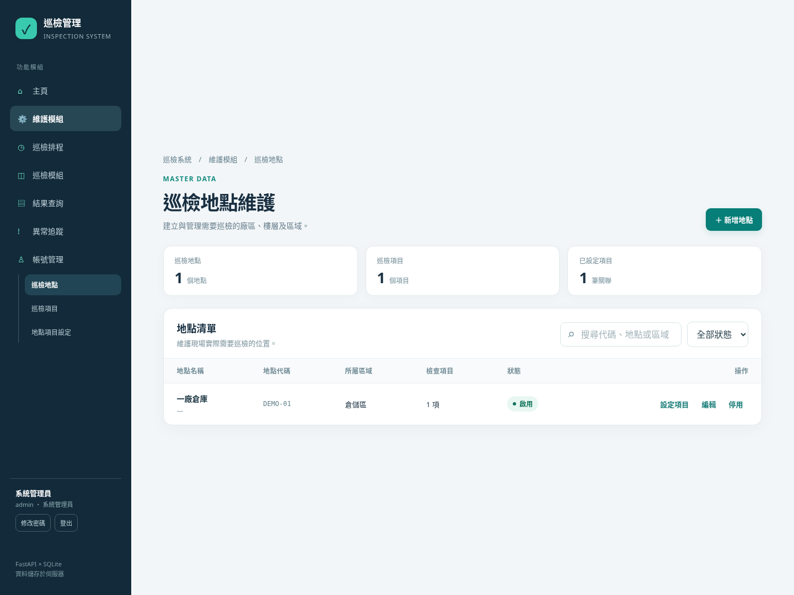

1. 選擇「維護模組」→「巡檢地點」。
2. 按新增地點，填入唯一代碼、名稱及區域等欄位，例如 `DEMO-01`／「一廠倉庫」。
3. 保持地點啟用並儲存，可用搜尋或狀態篩選確認。

**確認結果：** 地點出現在清單中。只有建立地點還不能開始巡檢，接著需建立項目並完成關聯設定。

## 06｜新增巡檢項目

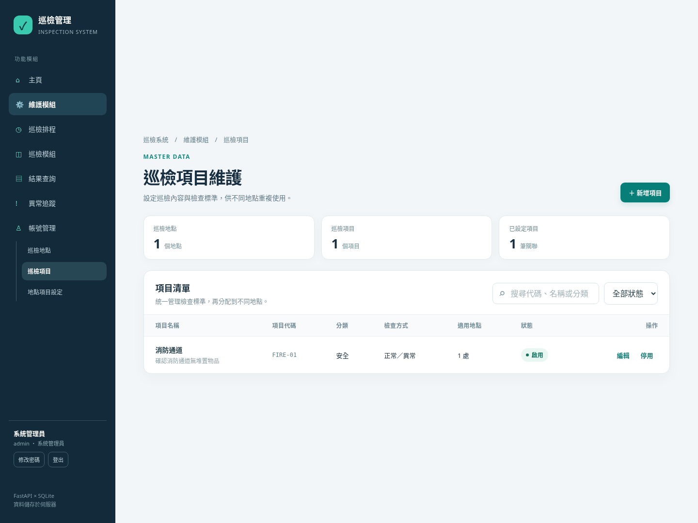

1. 選擇維護模組下的「巡檢項目」，按新增項目。
2. 填入唯一代碼、項目名稱、分類、說明及檢查方式，例如「消防通道」。
3. 選擇「正常／異常」或包含「不適用」的檢查方式，保持啟用並儲存。

**確認結果：** 清單顯示項目及檢查方式。項目可供多個地點使用，不必為每個地點重複建立。

## 07｜設定地點與項目的關聯

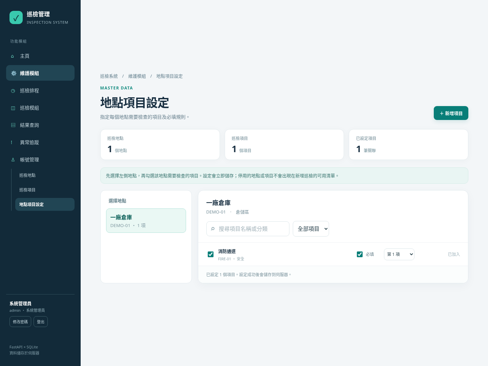

1. 選擇「地點項目設定」，點左側要設定的地點。
2. 勾選該地點需要的項目，調整順序與必填規則。
3. 設定會立即儲存，確認畫面顯示的已選項目與數量。

**確認結果：** 該地點有啟用且關聯的項目，可出現在可巡檢清單。停用地點或項目不會用於新的巡檢；既有巡檢快照不隨維護設定改寫。

## 08｜建立排程與查看任務

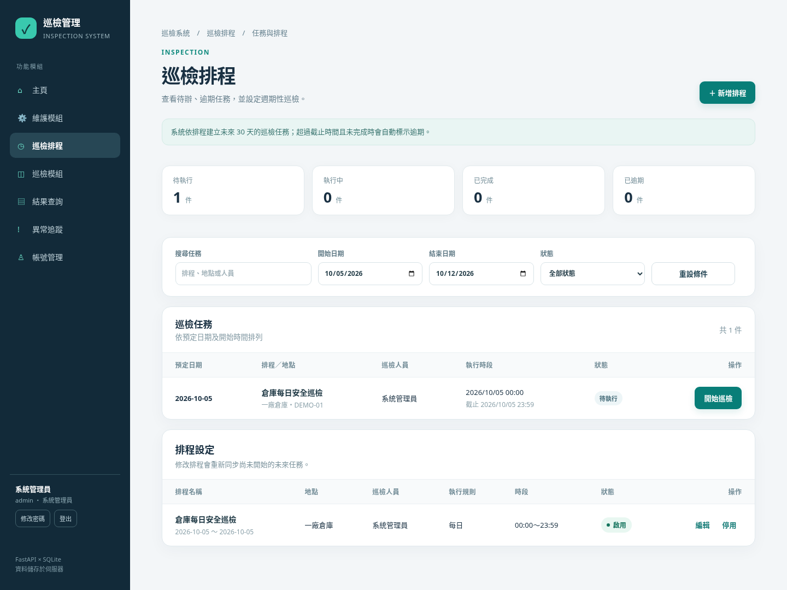

1. 管理員進入「巡檢排程」，按右上角「新增排程」。
2. 填入排程名稱、地點與指定巡檢人員。
3. 選擇單次、每日、每週或每月；依頻率設定星期或每月日期。
4. 填入開始時間、截止時間、生效日期及選填結束日期，按「儲存排程」。
5. 在上方任務清單依日期、名稱或狀態搜尋，由指定巡檢人員按「開始巡檢」。

**確認結果：** 任務由待執行轉成執行中，開啟巡檢草稿。排程使用 `Asia/Taipei` 時區；修改或停用排程會重新同步未開始的未來任務，已開始或完成的任務不會被改寫。

## 09｜填寫巡檢、暫存與照片上傳

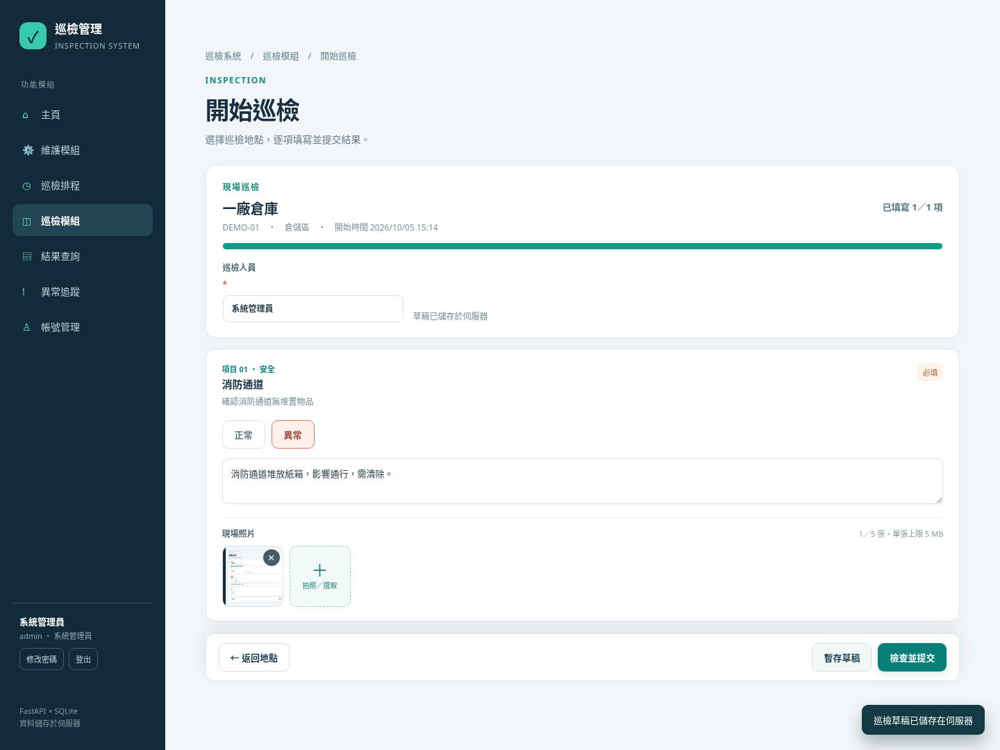

1. 逐項選擇正常、異常，或該項目允許的不適用。
2. 若選異常，在備註欄說明情況，例如「消防通道堆放紙箱，影響通行，需清除」。
3. 點照片區的「＋／拍照／選取」，選擇現場 JPEG、PNG 或 WebP 檔案，確認縮圖出現。裝置支援時可拍照。
4. 按「暫存草稿」；離開後可從待續草稿、原地點或排程的「繼續巡檢」回來。

**照片限制：** 預設每項最多 5 張，每張 5 MB。草稿階段可刪除照片，提交後不能新增或刪除。管理員調整限制後，以實際伺服器設定為準。

**確認結果：** 填寫進度更新，備註及照片被保存。若提示資料已有新版本，重新讀取後再操作，避免覆蓋其他頁面更新。

## 10｜檢查並提交

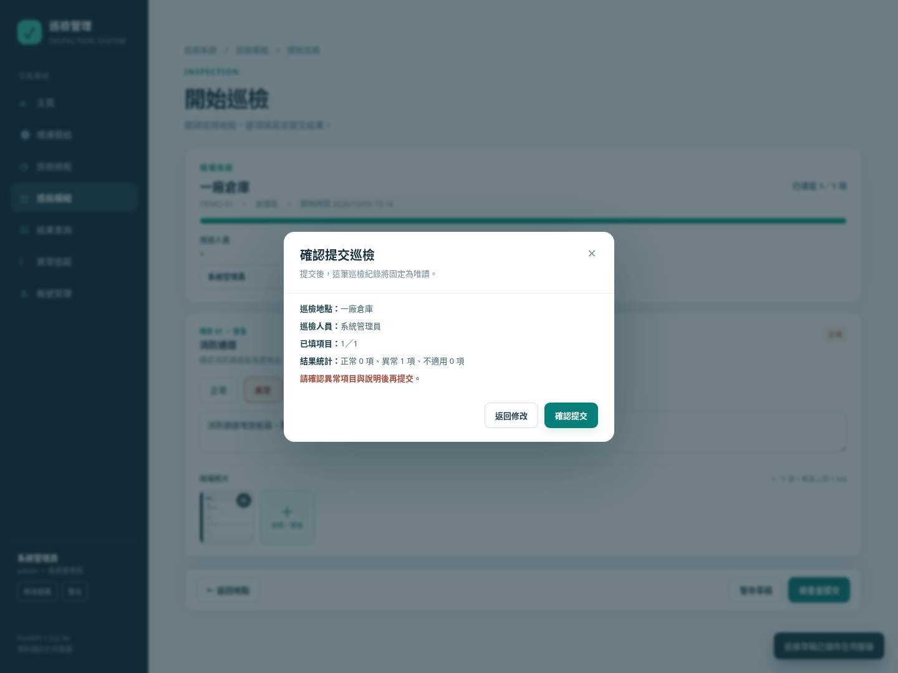

1. 完成所有必填項目，異常項目填入說明。
2. 按「檢查並提交」，檢查確認視窗的內容。
3. 確認無誤後按視窗中的提交按鈕；若有問題，返回草稿修正。

**確認結果：** 紀錄成為已提交；透過排程啟動的巡檢會完成對應任務。每個異常項目自動產生異常案件。提交後紀錄唯讀，請在送出前確認資料。

## 11｜查詢巡檢結果

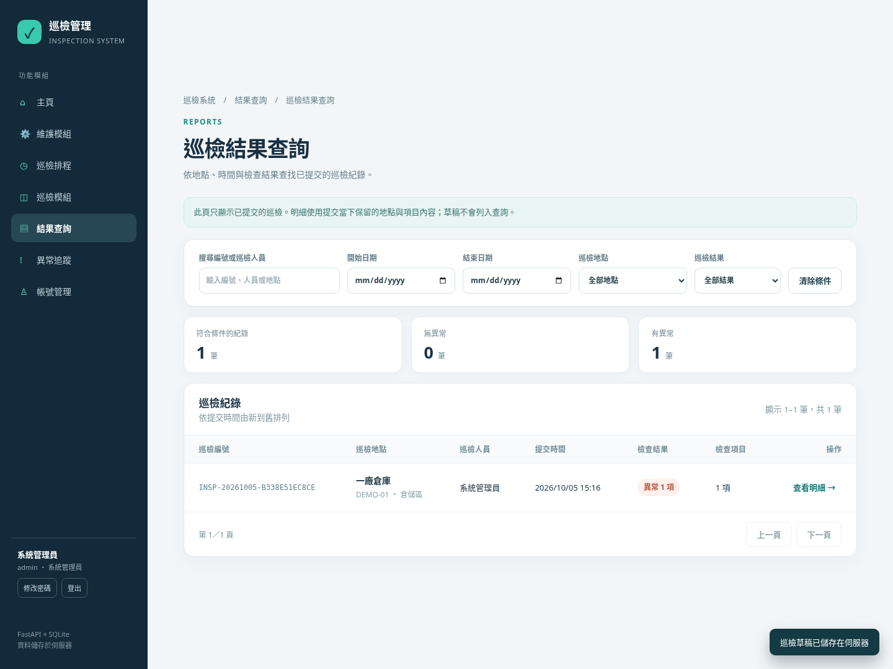

1. 選擇「結果查詢」，依日期、地點及結果等條件篩選。
2. 開啟紀錄明細，查看各項結果、異常說明及照片。
3. 點照片可查看原始附件；有異常案件時可透過案件連結進入追蹤。

**確認結果：** 找到剛提交的紀錄及照片。巡檢人員只能查看自己的巡檢紀錄；查詢人員可查看已提交紀錄。

## 12｜找到異常案件

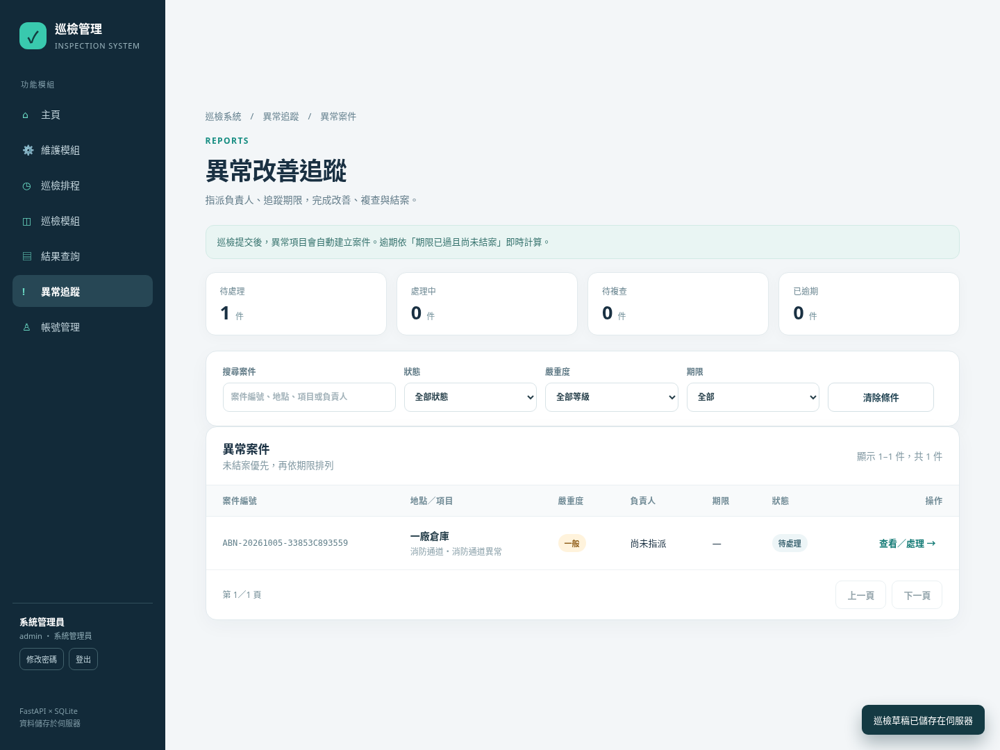

1. 選擇「異常追蹤」，依狀態、地點、嚴重度或負責人等條件查詢。
2. 找到對應地點及項目，按「查看／處理」。
3. 確認原始異常說明與照片；必要時按「查看原始巡檢」查核來源。

**狀態流程：** 待處理 → 處理中 → 待複查 → 已結案。退回後回到處理中；管理員也可填寫原因取消案件。

## 13｜指派負責人與期限

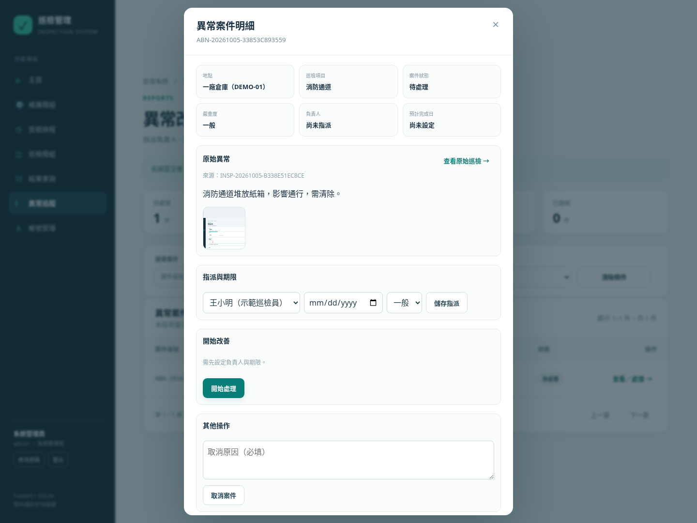

1. 管理員在「指派與期限」選擇負責人。
2. 設定預計完成日與嚴重度，按「儲存指派」。
3. 負責人開啟案件後按「開始處理」，進入改善階段。

**確認結果：** 案件顯示負責人、期限及處理中狀態。開始處理前必須已有負責人與期限；巡檢人員僅能查看自己提報或負責的案件。

## 14｜改善處理與送出複查

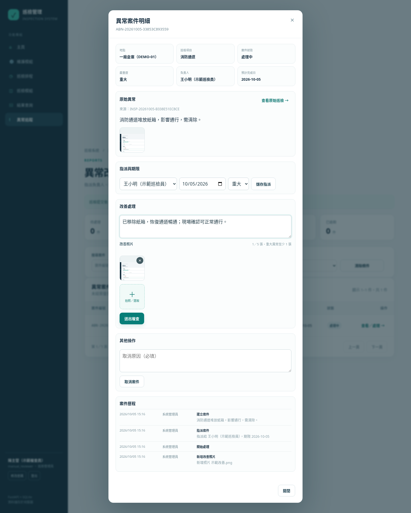

1. 負責人填寫改善措施，說明實際處理方式及結果。
2. 上傳改善照片，確認縮圖及文字內容都正確；若上傳後欄位重新整理，送出前重新核對改善說明。
3. 按「送出複查」。重大異常必須至少有一張改善照片。

**確認結果：** 案件變成待複查，改善說明與附件可供管理員查核。改善與複查階段預設各最多 5 張照片。

## 15｜複查通過或退回

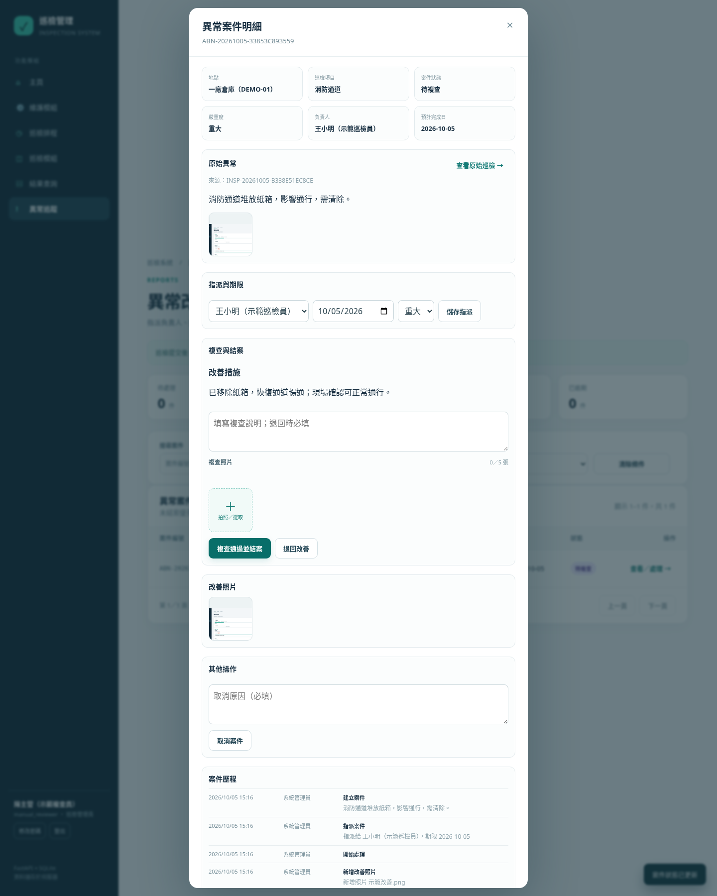

1. 由有管理權限且不是原提報人的人員，查看原始異常與改善內容。
2. 填入複查說明，依需要上傳複查照片。
3. 確認改善完成後按「複查通過並結案」。若仍需改善，填入退回原因並按「退回改善」。

**確認結果：** 通過後成為已結案；退回則回到處理中。原提報人不可自行複查結案；不能用更換畫面或帳號顯示名稱繞過此限制。

## 16｜確認結案與處理歷程

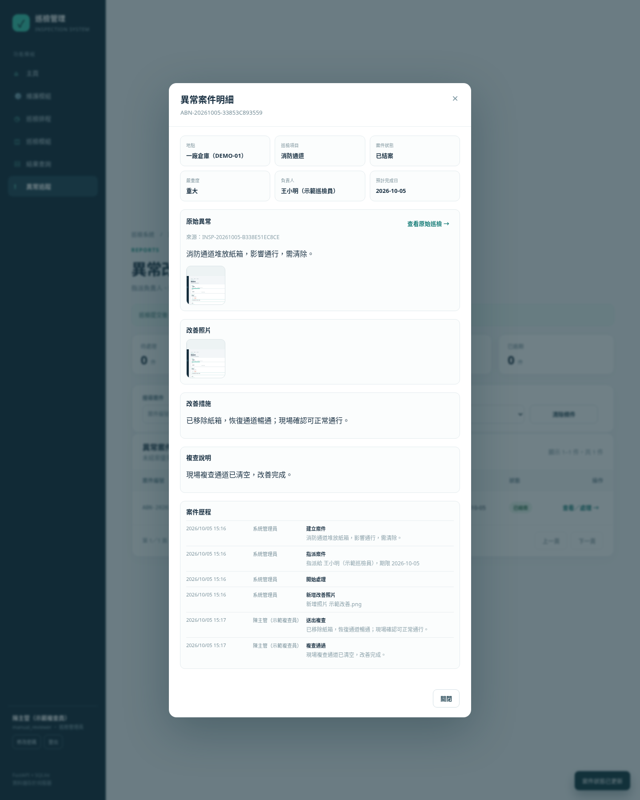

確認案件狀態為已結案，檢查改善說明、複查意見及下方處理歷程。可回到原始巡檢結果，確認關聯案件狀態也已更新。

**完成條件：** 排程任務已完成、巡檢紀錄已提交、照片可讀、異常案件已結案。畫面較長時請在案件視窗內往下捲動查看操作區與歷程。

## 常見問題與處理

| 現象 | 建議處理 |
| --- | --- |
| 登入失敗或被鎖定 | 核對帳密；鎖定後等待 15 分鐘，或請管理員協助 |
| 登入後無法操作 | 完成首次修改密碼，再確認角色權限 |
| 地點顯示暫不可巡檢 | 確認地點與項目啟用，且已建立關聯 |
| 看不到指定排程任務 | 核對日期篩選、指定人員與台北時區 |
| 無法提交巡檢 | 填完必填結果，補上每個異常項目的說明 |
| 照片無法上傳 | 使用支援格式，確認檔案大小、數量與紀錄是否仍為草稿 |
| 案件不能開始處理 | 先儲存負責人與預計完成日 |
| 重大異常不能送複查 | 至少上傳一張改善照片，並填寫改善說明 |
| 不能複查結案 | 確認案件待複查、具管理員權限，且不是原提報人 |
| 資料版本衝突 | 重新讀取最新資料再修改，不要重複強制送出 |

## 管理員日常工作

- 離開共用裝置前請登出；臨時密碼需交由本人修改。
- 定期檢查逾期任務與異常案件，安排代理或調整排程。
- 依 [README 的備份指引](../README.md#備份與還原) 同時備份 SQLite 與照片；Git 不會備份業務資料。
- 正式對外服務需使用 HTTPS。此手冊中的資料與附件皆為示範，不應當成真實巡檢證據。
